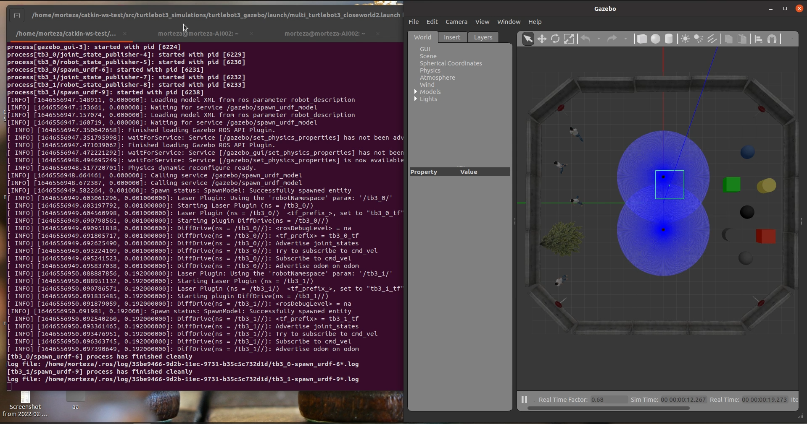
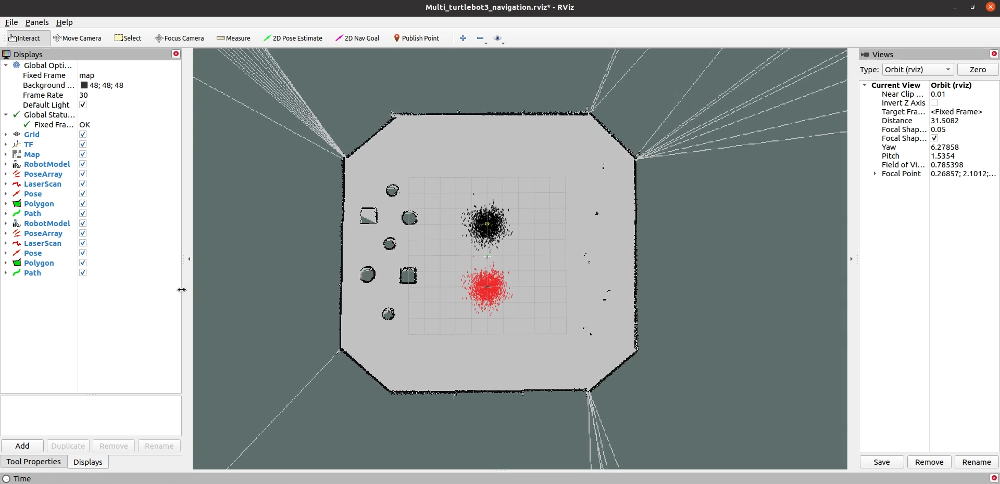
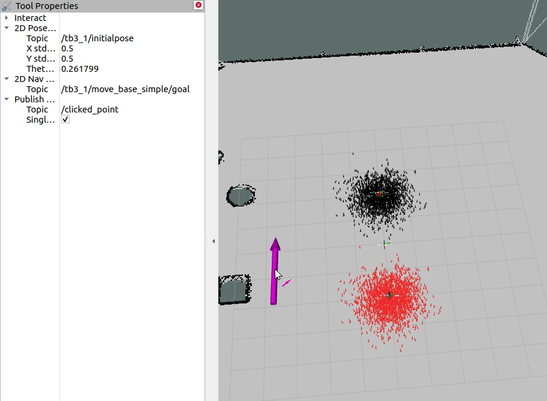

# Multi-Robot-Gazebo-NaviStack
This repo relates to multi-mobile robots in the Gazebo simulator. Based on Navigation stack packages, an environment map is created and each robot can do motion planning.
---
If you like the project give me a star! :star: 

You can see the video: &nbsp;&nbsp;
[](https://www.youtube.com/watch?v=XaLbEKf8UhA)
&nbsp;&nbsp;
---

### The requirements of this project are :
- Ubuntu Focal 
- ROS Noetic
- GAzebo 11
### Install 
---
```
source /opt/ros/noetic/setup.bash
cd catkin_ws
wget https://gist.githubusercontent.com/airuchen/5e58eb5dc54d6dc38ea5d2bedd53f69e/raw/ae3b850aca5a0577105c682eec1ab3b534161cc2/multi_omnibot.repos
catkin_make
source devel/setup.bash
```
 Open terminal then type blow commands:
 
 ```
roslaunch turtlebot3_gazebo Multi_turtlebot3_Closeworld2.launch
```

If you haven't seen error the Gazebo environment should launch. Then type below command:



 ```
roslaunch turtlebot3_navigation multi_turtlebot3_navigation.launch
```


Then click right on "2D nav Goal"  and add "Tool Properties" as new panel to RVIZ.
Then you can change the 2D nav Goal topic to "/tb3_1/move_base_simple/goal" or "/tb3_2/move_base_simple/goal" like below picture:




